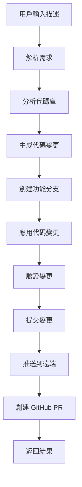

# 🚀 Instant PR Creator

## 概述

這個功能允許用戶通過自然語言描述來自動創建完整的 GitHub Pull Request，包括代碼變更、分支創建、提交和 PR 提交。

## 功能特點

### ✨ 核心功能
- **自然語言解析**: 將用戶描述轉換為具體的編程任務
- **智能代碼生成**: 基於現有代碼庫結構自動生成相應代碼
- **完整 Git 流程**: 自動創建分支、提交變更、推送和創建 PR
- **即時反饋**: 通過 LINE Bot 提供實時處理狀態更新

### 🎯 支援的操作類型
- **添加功能** (add/create/implement)
- **修復問題** (fix/repair/resolve)
- **更新代碼** (update/modify/change)
- **重構代碼** (refactor/restructure)
- **改進優化** (improve/enhance/optimize)
- **刪除功能** (remove/delete)

## 使用方法

### 在 LINE Bot 中使用
```
create pr: 您的需求描述
```

### 範例
```
create pr: 添加用戶登入功能，支援 email 和密碼驗證
```

```
pr: 修復名片識別時的圖片處理錯誤
```

```
create pr: 重構資料庫連接代碼，提高性能
```

### 直接命令行使用
```bash
python pr_creator.py "添加用戶註冊API endpoint"
```

## 技術架構

### 🏗️ 系統組件

#### 1. PRCreator 主類
- `create_instant_pr()`: 主要入口函數
- 負責協調整個 PR 創建流程

#### 2. 需求解析器
- `_parse_pr_description()`: 解析自然語言描述
- `PRRequirement` 資料類: 結構化需求表示
- 支援動作類型、目標和優先級識別

#### 3. 代碼庫分析器
- `_analyze_codebase()`: 分析現有代碼結構
- 識別技術棧（Python, Flask, JavaScript 等）
- 分析檔案結構和模式

#### 4. 代碼生成器
- `_generate_code_changes()`: 生成具體代碼變更
- `CodeChange` 資料類: 表示單個代碼變更
- 支援檔案創建、修改和刪除

#### 5. Git 操作管理器
- 自動分支創建和切換
- 智能提交訊息生成
- GitHub PR 創建（使用 gh CLI）

### 🔄 處理流程



## 智能特性

### 🧠 自然語言理解
- **動作識別**: 自動識別用戶想要執行的操作類型
- **目標提取**: 從描述中提取要修改的檔案或功能
- **優先級推斷**: 根據關鍵字判斷任務緊急程度

### 📁 代碼庫感知
- **技術棧檢測**: 自動識別項目使用的技術
- **檔案結構分析**: 理解項目組織結構
- **模式識別**: 識別現有代碼模式和約定

### 🎨 智能代碼生成
- **上下文相關**: 根據現有代碼風格生成新代碼
- **框架整合**: 自動整合到現有框架（如 Flask）
- **最佳實踐**: 遵循代碼最佳實踐和約定

## 配置需求

### 必要環境
- Git repository 已初始化
- GitHub CLI (`gh`) 已安裝並認證
- Python 3.7+

### 相依套件
```python
# 已整合到現有的 requirements.txt
subprocess  # 內建
json       # 內建  
tempfile   # 內建
re         # 內建
datetime   # 內建
typing     # 內建
dataclasses # Python 3.7+
```

## 錯誤處理

### 🛡️ 安全措施
- **語法驗證**: 自動檢查生成代碼的語法正確性
- **回滾機制**: 發生錯誤時自動回滾變更
- **沙盒環境**: 在分支中進行所有變更，不影響主分支

### 📊 結果回報
```json
{
  "success": true,
  "pr_url": "https://github.com/user/repo/pull/123",
  "branch_name": "feature/add_user_auth_0728",
  "changes_applied": 3,
  "validation_passed": true,
  "details": {
    "requirements": [...],
    "changes": [...],
    "validation": {...}
  }
}
```

## 進階使用

### 🎯 自訂代碼生成
可以在 `PRCreator` 類中新增特定的代碼生成邏輯：

```python
def _generate_custom_changes(self, req: PRRequirement, codebase_info: Dict):
    """自訂特定功能的代碼生成邏輯"""
    # 實作您的自訂邏輯
    pass
```

### 🔧 擴展支援
- 添加新的程式語言支援
- 整合更多 AI 模型進行代碼生成
- 支援更複雜的專案結構

## 限制與注意事項

### ⚠️ 當前限制
- 主要針對 Python/Flask 專案優化
- 需要 GitHub CLI 和適當權限
- 生成的代碼可能需要人工審查
- 複雜邏輯可能需要多次迭代

### 💡 最佳實踐
1. **清晰描述**: 提供具體、清晰的需求描述
2. **漸進開發**: 將大功能拆分為小步驟
3. **代碼審查**: 始終審查自動生成的代碼
4. **測試驗證**: 在部署前進行完整測試

## 範例使用案例

### 案例 1: 添加新 API 端點
```
create pr: 添加 /api/users 端點，支援用戶列表查詢和分頁
```

### 案例 2: 修復已知問題
```
pr: 修復批次處理模式下的記憶體洩漏問題
```

### 案例 3: 功能改進
```
create pr: 改進名片識別準確率，添加圖片預處理和重試機制
```

### 案例 4: 代碼重構
```
pr: 重構 notion_manager.py，將大函數拆分為小函數並添加錯誤處理
```

## 未來改進計劃

### 🚀 即將推出
- [ ] 支援更多程式語言 (JavaScript, Go, Java)
- [ ] 整合 AI 程式碼審查
- [ ] 自動測試生成
- [ ] 更智能的衝突解決
- [ ] 視覺化 PR 預覽

### 🎯 長期目標
- [ ] 支援微服務架構
- [ ] 資料庫遷移自動生成
- [ ] 完整的 CI/CD 整合
- [ ] 多專案協作支援

---

> 🤖 **由 Claude Code 自動生成和維護**
> 
> 這個功能展示了 AI 輔助開發的強大潛力，讓開發者能夠通過自然語言快速實現功能需求。